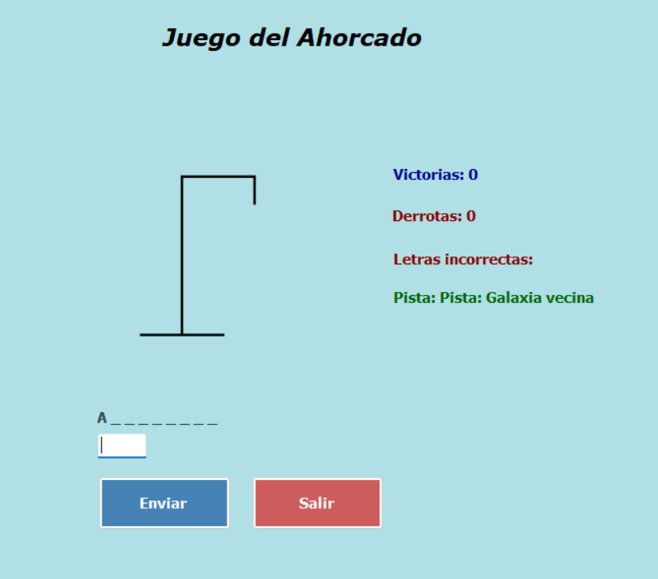
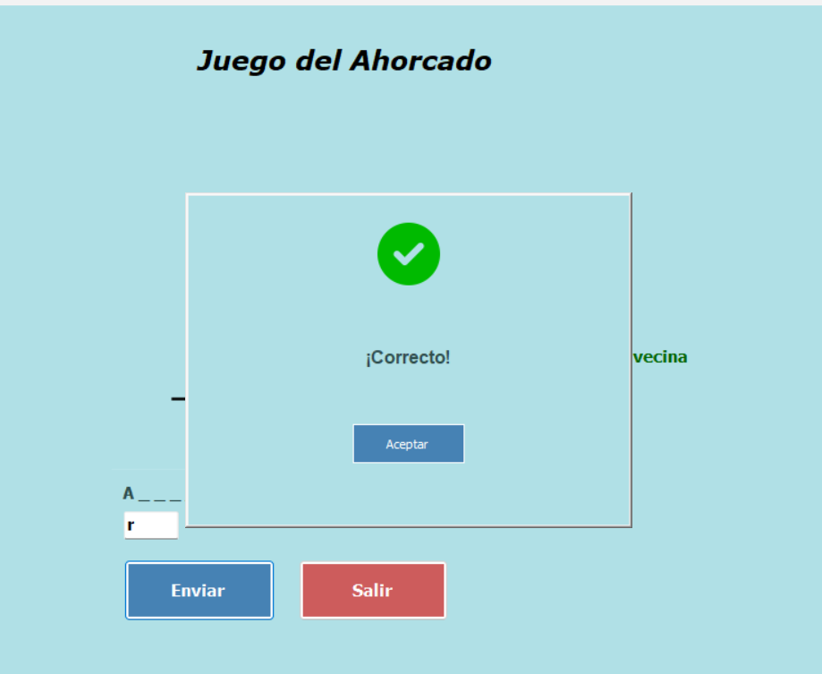
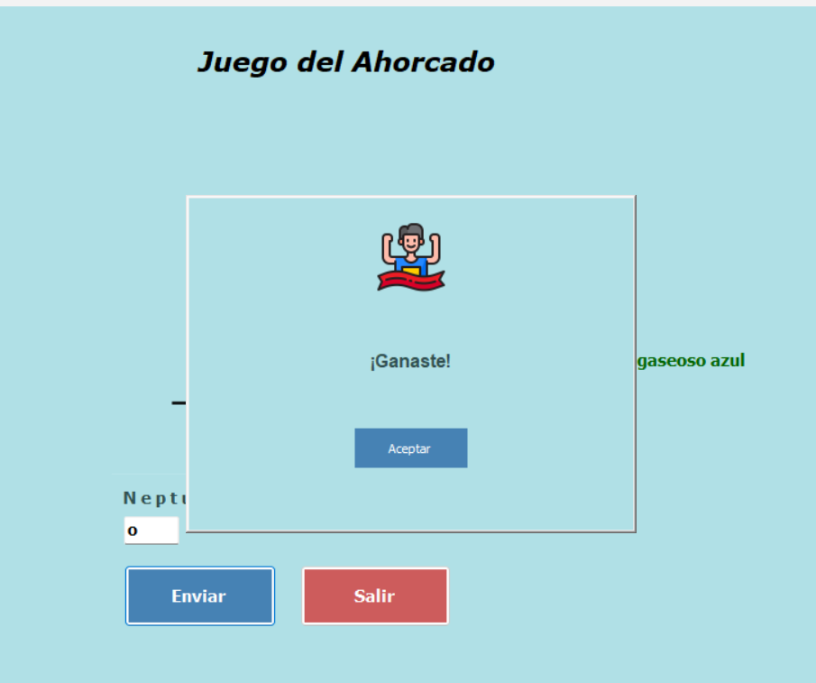
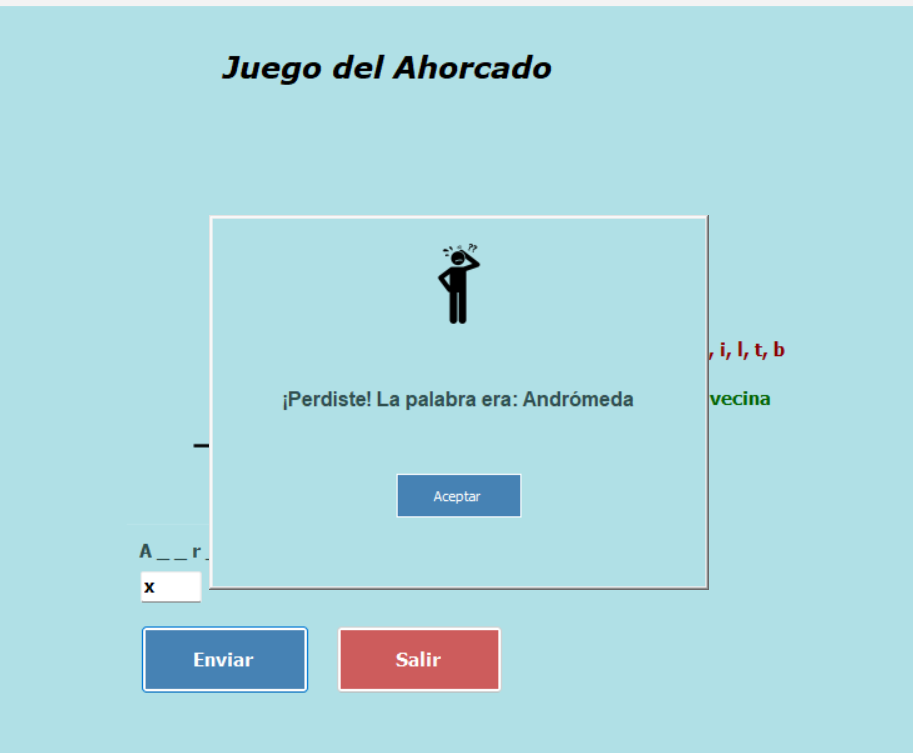

# 🎮 Juego del Ahorcado

Una implementación interactiva y divertida del clásico juego del "Ahorcado". El objetivo es adivinar la palabra secreta antes de agotar los intentos, contando con pistas contextuales para ayudar al jugador.

## ✨ Características del Juego

- **Interfaz Intuitiva**: Diseño limpio y fácil de usar.
- **Sistema de Pistas**: Cada partida incluye una pista para ayudarte a descubrir la palabra oculta.
- **Control de Estado**:
    - Seguimiento en tiempo real de **Victorias** y **Derrotas**.
    - Lista de **letras incorrectas** ingresadas para evitar errores repetidos.
- **Validaciones**: El juego detecta automáticamente si una letra ya fue ingresada, evitando intentos duplicados innecesarios.
- **Mensajes de Retroalimentación**: Alertas claras cuando pierdes o cometes un error.

## 📸 Capturas del juego

### Pantalla de inicio

### Partida en curso

### Victoria

### Derrota

## Cómo Jugar

1. **Adivina la palabra**: Escribe una letra en el campo de entrada y presiona "Enviar".
2. **Usa la pista**: Observa la pista proporcionada a la derecha para obtener una ventaja.
3. **Controla tus fallos**: Si ingresas una letra incorrecta, aparecerá en la lista y tus intentos disminuirán.
4. **Resultado**: El juego te notificará si logras adivinar la palabra o si alcanzas el límite de intentos.

## ✨ Tecnologías

- **Lenguaje**: C# (.NET)
- **Interfaz Gráfica**: Windows Forms
- **Estructura**: Programación orientada a objetos (POO) con separación de lógica y vistas modulares.

## 🚀 Cómo ejecutar el proyecto

1. Clonar el repositorio
2.    git clone https://github.com/Vanessa1356458/juego-ahorcado-windforms.git
---

## 👩‍💻 Autora

*Vanessa Rodriguez*
